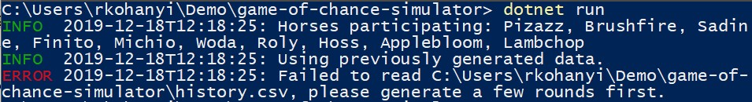

# Game of Chance Simulator

## Story

In this project your task is to select a game of chance and write a simulation to test out how we could win on it with the best probability.

1. Select a gambling game (**tippmix, formula 1, illegal car race, horse race, cock fight, etc. or something else, but be sure check with the mentors**).
1. **Make sure you understand the _game of chance_ you've selected for yourself.**
    * Don't choose roulette if you don't care about it, or don't know the rules, instead create a "fictive game" (e.g. _jedi master tournament_) where you can set up some fun rules for yourself to enjoy.
1. Define your game's historical data structure (e.g. what will be in a CSV file that you're going to generate).
1. Simulate a "round" of game (e.g. one game of tippmix, one round of horse race) and save the result.
1. Repeat this several times (_lots_ of times) and save each result, this will be your historical dataset.
1. Analyze your historical data and figure out a winning strategy (e.g. which horse to bet to maximize profit).

**Don't use the words related to _gambling_ in your repository**, because GitHub might ban your account. **Do not use these words**: gambling, roulette, bet, lottery, casino, etc.

### Example

As an example of what you need to create here's the output of our reference code, a horse racing simulator.

#### Running _without_ command-line arguments

When run without arguments (`dotnet run`) the program prints out some diagnostic information, tries to load historical data and finally it fails with an error message (`history.csv` doesn't exist).



#### Running _with_ command-line arguments

Here `10` is pass on to the program as a command-line argument (`dotnet run 10`), which means we ask the program to generate 10 rounds of historical, simulated data for us.

Af this is done, the program uses this to evaluate what's the best tactic to win in the game.


Running the application again with `dotnet run` would repeat this without generate new rounds of simulated games. Running `dotnet run 10` would add 10 new rounds of game and reevaluate the results.

## What are you going to learn?

In this project

* you'll be using command-line arguments to provide config data to your program (as opposed to asking for user input).
* you're going to practice basic control flow structures and use generic collections.
* you'll need to read and write CSV files which will store historical and other kind of data related to your game.
* you'll practice designing classes according to specification and familiarize yourself with modular code.
* you'll learn about what Dependency Inversion is and how it's useful in breaking up your application logic.
* you'll practice how and where to handle exceptions and raising them to create a stable, working program.

## Tasks

<style>
  table.tasks li > p { margin: 0; }
</style>
<table class="tasks">
  <thead>
    <tr>
      <th>Title</th>
      <th>Acceptance criteria</th>
    </tr>
  </thead>
  <tbody>
      <tr>
        <td>Functional Requirements</td>
        <td>
          <p>The program must adhere to all functional requirement.</p>
          <ul>
              <li>Program runs on other machines where the .NET Core runtime's required version is installed without runtime problems. Not just on the machine the program was developed on.</li>
              <li>Every class must be in the <code>GameOfChanceSimulator</code> namespace.</li>
              <li>There should be single class (<code>Program</code>) that contains the program's main entry point (<code>Main</code>).</li>
              <li>When running the program without supplying command-line arguments it should try to load already generated historical data from a file called <code>history.csv</code>. If the file doesn't exist or if it's empty the program should notify users about the problem and terminate.</li>
              <li>When running the program the first command-line argument supplied to it should be interpreted as the number of game rounds to be generated and stored as historical data. The program should validate that this is a positive whole number, otherwise it should notify users about the problem and terminate.</li>
          </ul>
        </td>
      </tr>
      <tr>
        <td>Object-oriented Design</td>
        <td>
          <p>While following the given specification to the letter adhere to the Encapsulation and Data-hiding Principles where appropriate.</p>
          <ul>
              <li>Every <em>class</em> is given the strictest access modifier possible.</li>
              <li>Every <em>property</em> is given the strictest access modifier possible.</li>
              <li>Every <em>field</em> is given the strictest access modifier possible.</li>
              <li>Every <em>constructor</em> is given the strictest access modifier possible.</li>
              <li>Every <em>method</em> is given the strictest access modifier possible.</li>
              <li>Semantically read-only properties are exposed with appropriate access modifiers (including property getters and setters).</li>
              <li>The implementation consist (at least) the following classes (and possibly more): <code>Program</code>, <code>ILogger</code>, <code>ConsoleLogger</code>, <code>DataEvaluator</code>, <code>HistoricalDataSet</code>, <code>HistoricalDataPoint</code>, <code>Result</code>.</li>
              <li><code>Program</code> contains a static main method: <code>void Main(string[])</code>.</li>
              <li><code>Program</code> contains the static method: <code>HistoricalDataSet GenerateHistoricalDataSet(string[])</code>. <strong>Note</strong>: calling the method generates historical data (as many rounds as the <code>rounds</code> parameter specifies) or if the parameter's value is <code>0</code> it loads existing data from a file called <code>history.csv</code>.</li>
              <li><code>HistoricalDataSet</code> contains the constructor: <code>HistoricalDataSet(ILogger)</code>. <strong>Note</strong>: there can be more constructors which can declare more parameters if required.</li>
              <li><code>HistoricalDataSet</code> contains a read-only property to expose the number of the underlying data points: <code>int Size</code>. <strong>Note</strong>: can be declared as an automatic property.</li>
              <li><code>HistoricalDataSet</code> contains a read-only property to expose the underlying list of historical data points: <code>IReadOnlyList&lt;HistoricalDataPoint&gt; DataPoints</code>. <strong>Note</strong>: can be declared as an automatic property.</li>
              <li><code>HistoricalDataSet</code> contains a public method that can generate new data points: <code>void Generate()</code>. <strong>Note</strong>: calling the method generates a <em>single</em> new (randomized) <code>HistoricalDataPoint</code> instance, it adds this to the list of available <code>DataPoints</code> stored by the class and finally appends a new entry to <code>history.csv</code>.</li>
              <li><code>HistoricalDataSet</code> contains a public method that can load already generated historcal data as data points: <code>void Load()</code>. <strong>Note</strong>: calling the method reads already generated data points from <code>history.csv</code>, it creates an instance of <code>HistoricalDataPoint</code> for <em>each</em> entry in the CSV file.</li>
              <li>One or more classes makes up data related related to the game of chance. These are used everywhere instead of arrays of strings, complicated dictionaries, etc. E.g. in a horse race game one such class could be <code>Horse</code> which stores every data about a single horse participating in races. <strong>Note</strong>: it'd a idea to store such data in a CSV file, like <code>horse.csv</code> in the case of a fictional horse race simulator.</li>
              <li><code>HistoricalDataPoint</code> encapsulates all state the describes the input and output for a round of game. E.g. in a horse race simulator it could store the names of the horses that participated in a race and the order that they've finished after the race. <strong>Note</strong>: a <code>HistoricalDataPoint</code> instance should be mappable to a line in <code>history.csv</code> and vica versa.</li>
              <li><code>DataEvaluator</code> contains the constructor: <code>DataEvaluator(HistoricalDataSet, ILogger)</code>. <strong>Note</strong>: there can be more constructors which can declare more parameters if required.</li>
              <li><code>DataEvaluator</code> contains a public method that evaluates historical data points in order to generate a result object: <code>Result Run()</code>. <strong>Note</strong>: calling the method uses the data evaluator's state (the data points it was supplied during its construction) to do some calculation in order to be able to create a <code>Result</code> instance. E.g. in a horse race simulator it counts and determines which horse won first place most frequently and what's the percentage of winning when betting on that horse. <strong>Important</strong>: keep it dead simple, creating a game with convulated logic is not the point.</li>
              <li><code>Result</code> contains the constructor: <code>Result(int, string, float)</code>. <strong>Note</strong>: there shouldn't be other constructor declared on this class.</li>
              <li><code>Result</code> contains a read-only property to expose the number of data points the result is based on: <code>int NumberOfSimulations</code>. <strong>Note</strong>: can be declared as an automatic property.</li>
              <li><code>Result</code> contains a read-only property to expose what's the best choice to win in this game: <code>string BestChoice</code>. E.g. the name of the best horse to bet on in a horse race simulator. <strong>Note</strong>: can be declared as an automatic property.</li>
              <li><code>Result</code> contains a read-only property to expose what's the chance of winning when betting on the best choice in this game: <code>float BestChoiceChance</code>. E.g. something like <code>0.4f</code> (which translates to <code>40 %</code> - should be a floating point number in range between <code>0.0f</code> and <code>1.0f</code>). <strong>Note</strong>: can be declared as an automatic property.</li>
              <li><code>ConsoleLogger</code> implements the <code>ILogger</code> interface and both the interface's virtual methods.</li>
              <li><code>ConsoleLogger</code> contains the constructor: <code>ConsoleLogger()</code>. <strong>Note</strong>: there shouldn't be other constructor declared on this class.</li>
              <li><code>ConsoleLogger</code> contains a public method (declared by <code>ILogger</code>) that logs <em>blue</em> informational messages to the console: void <code>Info(string)</code>. <strong>Note</strong>: the message format should be <code>INFO  2020-03-09T05:19:03: an informational message</code>.</li>
              <li><code>ConsoleLogger</code> contains a public method (declared by <code>ILogger</code>) that logs <em>red</em> informational messages to the console: void <code>Error(string)</code>. <strong>Note</strong>: the message format should be <code>ERROR 2020-03-09T05:19:03: an error message</code>.</li>
          </ul>
        </td>
      </tr>
  </tbody>
</table>


## General requirements


 - Every required class is instantiated _only once_ during the life-time of the program, except `HistoricalDataPoint`. **Note**: instantiate other classes as you like, but generally you should have one instance of everything more or less. 
 - All method signatures and return types are crafted for the purpose of enhancing your learning. Do not deviate from them, instead try to figure out how you could accomodate your code and thinking to them.
 - _Catch_ exceptions _only_ in the `Program` class and its methods, do not use try/catch any other place in your codebase. **Note**: youn can _throw_ exceptions anywhere.
 - The only thing that should be static in your codebase is the `Main` method and other methods which you are told to declare as static by the requirements. In any other instance discuss figure out how to avoid static references.
 - Declare variables using the narrowest scope possible. Don't declare fields/properties if a local variable declaration is enough.

## Hints

* Add this snippet to your project's configuration (`*.csproj`) if you have a file in your source tree that you want copy during the build process into the binary output folders (`bin/`).

```
<ItemGroup>
  <Content Include="your.csv">
    <CopyToOutputDirectory>Always</CopyToOutputDirectory>
  </Content>
</ItemGroup>
```

*Note*: make sure to reference your own file instead of `your.csv`.

## Starting repository

Click here to clone your own Git repository:
<https://classroom.github.com/g/FRWGC3Cw>

## Background materials

* [Microsoft "Member" Design Guideline](https://docs.microsoft.com/en-us/dotnet/standard/design-guidelines/member)
* [Variable scoping and how to reduce it](https://refactoring.com/catalog/reduceScopeOfVariable.html)
* Automatic properties in C#.
  * [Official Microsoft documentation](https://docs.microsoft.com/en-us/dotnet/csharp/programming-guide/classes-and-structs/auto-implemented-properties)
  * [Great blog post about the topic](https://gunnarpeipman.com/csharp-automatic-properties/)
  * [Q&A at StackOverflow](https://stackoverflow.com/questions/6001917/what-are-automatic-properties-in-c-sharp-and-what-is-their-purpose)
